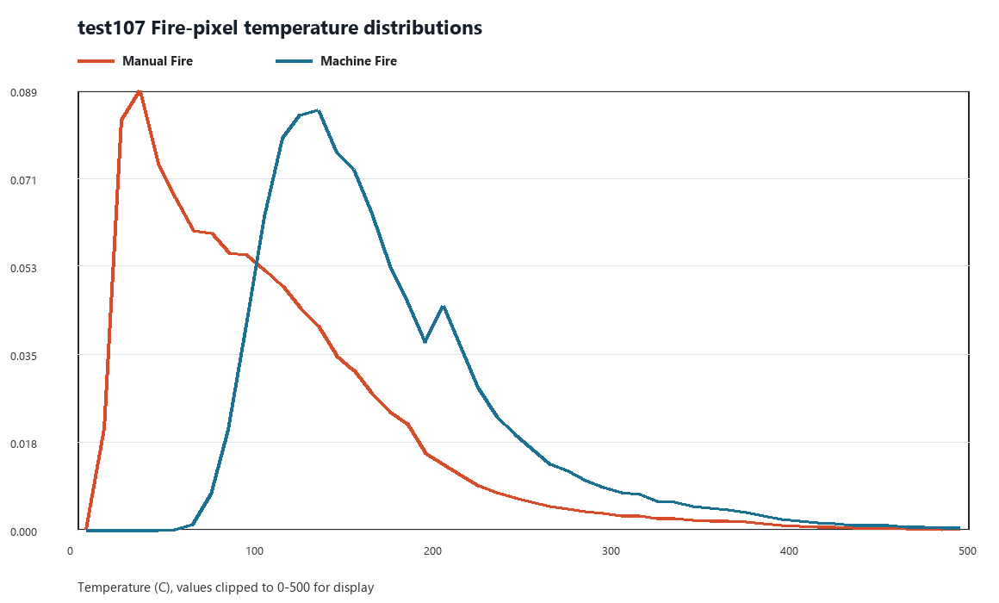
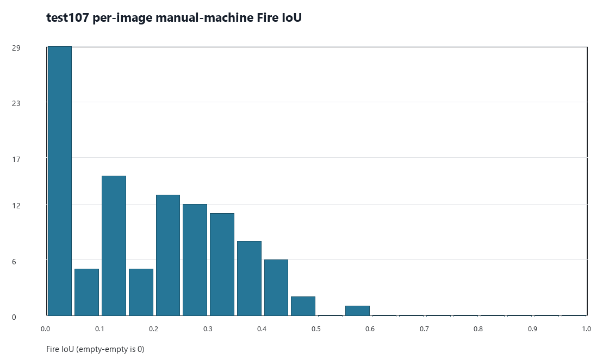

# FLAME3 标签鸿沟：以 test107 为证据基础的重建与锚定效应量化

日期：2026-08-24

本工单的证据基础是 test107 的标签统计量：人工掩膜、机器温度掩膜、Celsius TIFF，以及代表图所需的 RGB；不读取模型预测、不执行模型推理，因而不构成对测试集盲性的新增模型消耗。它取代“A001–A101 对齐后高一致性可证明人机标签高度一致”和“以 A001–A101 测量标签鸿沟”的既有解释；A001–A101 因以机器掩膜为标注起点，只能用于量化锚定后的表观一致性。

工单 SHA256：`d42df5d2ad07664eafec2173094b5a34aa1c05f4993c927e54af7ce3cafa8ed4`。运行模式：CPU-only；`CUDA_VISIBLE_DEVICES` 为空；掩膜写入数 `0`。

## 核心结论

test107 人工-机器 aggregate Fire IoU 为 `0.234093`；逐图均值/中位数为 `0.188505/0.177662`，定义非空的 `89` 张中位数为 `0.233964`。A001–A101 的 aggregate IoU `0.875330` 是锚定流程产物，不是独立人机语义一致证据。点估计上，锚定标注的表观 aggregate 一致性是从零起标的 `3.74x`。

## 任务一：test107 完整重建

人工/机器/交集 Fire 像素为 `459,557/205,329/126,121`；人工独有有效 `333,436`，其中 `<80 C` 为 `207,137`（`62.122%`）；机器独有有效 `79,208`，其中 `>=80 C` 为 `78,259`（`98.802%`）。机器 Fire 位于人工 Ignore 的 `9,001` 像素单列，不计入有效 FP。

### 温度分层四格表

| 温度 | TP | FP | FN | TN | Precision | Recall | 一致率 |
|---|---:|---:|---:|---:|---:|---:|---:|
| <50 | 0 | 0 | 121,893 | 31,012,191 | NA | NA | 0.996085 |
| 50-80 | 723 | 949 | 85,244 | 712,961 | 0.432416 | 0.008410 | 0.892242 |
| 80-100 | 5,583 | 6,469 | 45,569 | 214,749 | 0.463243 | 0.109145 | 0.808944 |
| 100-150 | 40,459 | 37,303 | 61,757 | 182,082 | 0.520293 | 0.395819 | 0.691979 |
| 150-200 | 36,491 | 20,214 | 18,973 | 29,829 | 0.643523 | 0.657922 | 0.628584 |
| 200-300 | 31,768 | 13,069 | 0 | 0 | 0.708522 | 1.000000 | 0.708522 |
| >=300 | 11,097 | 1,204 | 0 | 0 | 0.902122 | 1.000000 | 0.902122 |

FP 首次超过 FN 的错误方向转折箱：test107 为 `150-200`，A001–A101 对齐口径为 `100-150`。完整像素总数与 Ignore 分解见 `tables/TEMPERATURE_BIN_CONFUSION_TEST107_AND_A.csv`。

### 火像素温度分布

| 集合 | 标签 | 像素 | 中位数 C | Q1 | Q3 | >=80 C |
|---|---|---:|---:|---:|---:|---:|
| test107 | manual | 459,557 | 88.412 | 47.984 | 139.973 | 54.769% |
| test107 | machine | 214,330 | 156.025 | 124.453 | 204.288 | 99.162% |
| A001-A101 | manual | 510,378 | 180.450 | 122.193 | 239.574 | 87.484% |
| A001-A101 | machine | 450,050 | 186.331 | 143.119 | 252.692 | 99.539% |

### 逐图 IoU 与空集规则

全部107张的均值/中位数/5%-95%分位为 `0.188505/0.177662/0.000000-0.417134`。全图汇总将空-空定义为0，保持与 A001–A101 重算一致；只在明确命名为 defined-only 的统计中排除 union=0 的18张。

### 分歧原因与代表案例

像素级可直接确认的只有分歧方向、温度分箱以及 Ignore 归属。反光/传感器伪影与薄烟/过渡区仅是图像级代理，可用于挑选真实案例，不能据此把该图全部机器独有像素归因于该原因；注册热泄漏、其他异常、余热/热地面/无关热源在冻结字段中不可得。案例索引与可用数量见 `tables/REPRESENTATIVE_CASE_INDEX.csv`，图片见 `figures/representative_cases/`。

### 机器标签复现水平闭环

| Arm | 人工 Fire IoU | 超过0.234093的绝对值 | 相对提升 |
|---|---:|---:|---:|
| baseline | 0.297684 | 0.063591 | 27.165% |
| v1.1 | 0.287545 | 0.053452 | 22.834% |

两个 arm 均超过完全复现机器标签时对人工标签的复现水平，baseline 超出 0.063591，v1.1 超出 0.053452。可能来源包括 RGB 通道提供了温度阈值未覆盖的燃烧线索，但这只是待验证假说，不是本工单的证据结论。

对同一 test107，机器端点 `0.689` 到人工端点约 `0.298` 的差为 `0.391`。机器-人工 IoU `0.234093` 对应 Jaccard 距离约 `0.765907`；给定模型-机器 IoU 0.689，Jaccard 三角不等式允许模型-人工 IoU 位于 `0.000-0.545`，实测0.298位于区间内。另有 `0.689-0.234093=0.454907` 的标签端点落差，而模型对人工高于机器复现水平0.063591，数量上与观测端点差0.391自洽；这不能单独证明 RGB 的机制解释。

## 任务二：锚定效应的受控量化

| 方法 | A估计 | test估计 | 差距 | A样本 | test样本 |
|---|---:|---:|---:|---:|---:|
| raw_per_image_mean | 0.761891 | 0.188505 | 0.573385 | 101 | 107 |
| fixed_scale_bin | 0.705270 | 0.188505 | 0.516765 | 101 | 107 |
| machine_temperature_strata | 0.602579 | 0.188505 | 0.414073 | 101 | 107 |
| machine_area_quantiles | 0.658705 | 0.188505 | 0.470199 | 101 | 107 |
| combined_nearest_neighbor_within_scale | 0.830409 | 0.231840 | 0.598569 | 35 | 87 |

以逐图均值为分解口径，原始差距 `0.573385`；在固定尺度箱内同时按机器 Fire 面积和温度中位数最近邻匹配后，差距 `0.598569`，差距没有缩小，反而增加 `0.025184`。在该匹配估计中，已观测构成差异未解释原差距，而是掩盖了约 `4.4%`；剩余与锚定相关的受控关联为原差距的 `104.4%`；受控表观一致性倍数为 `3.58x`（匹配test图 `87` 张，唯一A图 `35` 张）。

这是操作性而非因果分解：集合身份与锚定流程仍完全共线，未观测的场景构成可能残留。因而可引用“控制已观测尺度与机器火温度后，锚定集合仍呈现更高表观一致性”，不得写成锚定单独造成了全部剩余差距。各层样本量见 `tables/CONTROLLED_ANCHORING_COMPARISON.csv`。

可直接引用：以机器掩膜为起点的 A001–A101，其与机器标签的表观 aggregate IoU 是从零起标 test107 的 `3.74x`；控制机器火尺度、面积与温度后，匹配逐图均值倍数为 `3.58x`（受集合残余混杂限制）。

## 任务三：锚定后果盘点

| 对象 | 判定 | 依据 |
|---|---|---|
| 人工三分类验证集v1 (A001-A047) | 受影响 | Fire/Heat从机器掩膜起步，端点与机器标签结构性共线；不能作为独立人类语义Fire模型选择端点。既有数值仍是该锚定协议下的描述值。 |
| 2x2归因与V1/V2只读验证 | 需限定表述 | 模型指标不变；Fire侧只能表述为对锚定端点的表现，不能外推为独立人类语义增益。Smoke与其他已保存量不因此重算。 |
| 已排队v1.2人工Fire训练标签 | 受影响 | 锚定Fire与机器标签高度重合，作为新监督信号近似复用机器标签，不能检验独立人工Fire监督的价值。 |
| 验证集v2的28张候选 | 受影响 | 必须从零起标；若以机器掩膜起步，将再次把被测标签写入参照端点。 |
| Smoke标注 | 需限定表述 | seed不含Smoke，Smoke为人工绘制，不存在同类机器Smoke锚定；但编辑界面展示机器Fire/原始Ignore，边界仍可能受上下文约束。 |
| Ignore标注 | 需限定表述 | Ignore由seed原始Ignore与人工新增Ignore混合；前者来自机器seed，后者人工绘制，不能一概称为从零或锚定。 |
| test107冻结评估 | 不受影响 | test107人工三分类从零起标；本工单只重算标签统计量，不推理、不改掩膜，冻结模型评估值不变。 |

## 任务四：勘误扩写

几何错位与标注锚定是两个独立机制：46 px 错位使一致性被低估；以机器掩膜为起点使一致性被高估，方向相反。A001–A101 对齐后的 `0.875330/0.906013` 不得再作为独立人机标签高度一致的证据。有效标签鸿沟证据改为 test107 的 aggregate `0.234093`、人工独有有效 `333,436` 和机器独有有效 `79,208`。任何用于测量人机标签差距的标注必须从零起标，此要求适用于验证集v2的28张候选。对应文字已生成到 `audit/ERRATA_APPEND_SECTION.md`，由同步步骤追加到四份既有勘误；原报告保持字节不变。

## 完整性与禁止事项

- 训练/推理次数：0；模型预测读取数：0；GPU使用：0。
- 掩膜输出数：0；所有读过的 test107 人工/机器掩膜均做运行前后 SHA256 比较。
- 输入哈希见 `audit/INPUT_SHA256.csv`，输出哈希见 `audit/OUTPUT_SHA256.csv`，只读守卫见 `audit/READONLY_GUARDS.json`。
