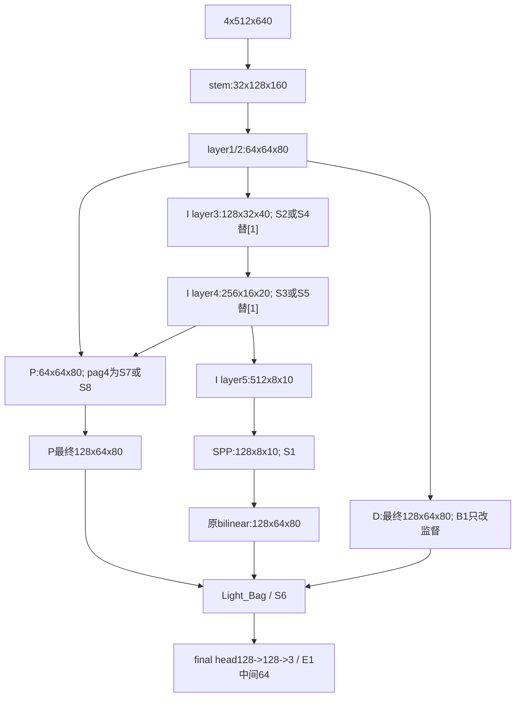

# FLAME3 网络结构改进筛选：阶段 0 设计审批包

日期：2026-09-17。状态：**设计提交，待用户审批；没有进入实现、工程门或训练。**

## 1. 本次边界与工单身份

执行文件：`G:/py2/预注册_网络结构改进筛选_修订版v2_20260917.md`，取代v1。

SHA256：`261989C8859E78C9825570253B42B3A0CBEE00664ABD641235FED88B49E9B876`。

只阅读源代码、配置、论文及历史非测试报告，并做纯静态算术。没有实例化模型、加载checkpoint、生成tensor、前向、推理、训练或读取任何数据集。未读test107图像、标签、预测或统计。工单点名的 `evaluate_test107_posthoc.py` 仅作为扰动函数**源代码文本**阅读/哈希，不导入运行其CLI。未改动v1.1配置、标签、checkpoint、冻结报告及旧工单。

文件实际列明S1-S8、R1-R3共11臂，另有B1和E1，**共13项**；用户消息“11臂+1工程对照”则是12项。本包覆盖全部13个已列明项目，不自行删除B1或新增候选。目录存在不代表获准实施。

本文的算子选择是送审提案，不是已经获准的协议补丁。v2中少数文字含替换字符，原文件保持不动。没有用后续模型结果选择位置、核大小或门控参数。

## 2. 首先需要用户决定的事项

| ID | 问题与证据 | 本包处理；进入下一阶段前需要的决定 |
|---|---|---|
| A01 | 11+1与正文/批次实际13项不一致 | 覆盖S1-S8/R1-R3/B1/E1；请确认13项均在审批范围 |
| A02 | `src/flame3_manual_smoke_v2_metrics.py:236,252` 中S含Fire IoU；v2又禁止Fire参与任何通过判定 | **阻塞全局评价协议**。不擅自删S规则或重定义S。建议S/best_S只作历史记录，筛选使用已注册Smoke规则，但须用户书面修订；S异常停机规则也要一起确认 |
| A03 | 旧S为Fire134与Smoke47混合，v2精度端点只列val47；No-Fire池也需明确 | 明确是val47内No-Fire还是既有独立护栏池；记录FP分母/样本域。不能直接复用旧134聚合器冒称全在val47。No-Fire联合误报含Fire预测是工单显式护栏，请确认其是允许的安全例外 |
| A04 | R2 sigmoid饱和1与可学习梯度存在矛盾，拆分卷积有累加舍入差 | 预算按原文sigmoid版；R2/R3保持阻塞。另列2sigmoid(z),z=0的备选供书面修订，**未采纳**；明确初始等价测试dtype，阈值不放宽 |
| A05 | “v1.1 stem权重”可能被误解为已训练权重 | 提案为同seed基线**初始化态**切片，不使用epoch30模型权重；确认实际初始化入口及与基线同起点 |
| A06 | R1未给概率、blur范围、dropout语义 | 提案clean=.5，其余三选一；blur sigma[.5,1.5]；dropout是5%面积128x128。请批准或在结果前修订 |
| A07 | B1双边界head形式、partial未知区域有效域、F1与Ignore邻域未完全给出 | 提案单head并集；未知非Fire不作Smoke边界负标签；详见B1页。需审批，不能把不明标签当阴性 |
| A08 | E1“只跑一次”与第一批9臂三seed冲突 | 预留三seed空表但不安排运行；确认seed200一次还是三seed，以及单seed工程对照能否作规则判定 |
| A09 | 工程门“同批集合loss一致”不能拿不同网络输出比较 | 提案用完全相同synthetic logits/targets/flags通过同一partial criterion断言；B1只比较未更改的语义集合loss，不要求总loss一致 |
| A10 | 护栏按哪个seed/window、best_S如何使用，正文未完全展开 | 提案epoch26-30固定窗口逐seed配对，3/3满足护栏；best_S只列记录、不替代主窗口。0.030指IoU绝对差，不是相对百分比；此解释须审批 |
| A11 | S1/S2“训练形态”与部署比较的BN模式未写出 | 提案比较未折叠与折叠的**eval形态**，同输入/权重，FP32和AMP分别报告；不得拿train-mode BN与部署硬比较，也不得更改1e-4阈值 |
| A12 | 历史对比原文把MRFF说成中层、CMRC说成随机非等价并不准确 | 以源码事实为准；R2页已更正。MRFF独立多seed失败原始记录本次未核验到，不填写不存在的结果 |

这些是**审批问题，不是已执行修改**。用户可以只批准已无歧义的结构设计进入工程实现，但全局评价协议未明确前不应启动正式筛选训练；当前用户只授权阶段0，任何后续都未启动。

## 3. 基线接口与静态估算口径

基线入口 `G:/py2/src/baseline_runtime.py:184`：m=2,n=3,planes32,ppm_planes96,head_planes128,classes3,input4。配置 `G:/py2/configs/flame3/pidnet_s_fusion_manual_smoke_v11_30e.yaml` 仅阅读。图中尺寸是CxHxW，不含batch。

图中各候选互为独立替换，**不是把所有模块装到同一网络**。R2只拆第一层卷积，R1只改训练热通道，R3才是工单明确允许的二因素组合。

冻结效率来源：`C:/Users/钱鹏程QQ78293044/Documents/论文2/FLAME3_SUBMISSION_SOURCE_20260822/results/efficiency/RTX4090_random_stem_seed200_epoch30.json`。字段`complexity`给部署7,623,939参数、7.470914048 GMACs（THOP口径）；`latency.p95_ms`为7.715948677，均值7.185028704。训练辅助head另93,156参数，故训练基线7,717,095。未读取该记录指向的checkpoint。

本包：参数按卷积权重/bias、BN affine精确算术；buffer不算参数。**GMACs是“冻结THOP基线 + 新旧卷积/矩阵乘MAC静态差”的代理值**，不是新的THOP实测；BN算术、激活、池化、插值、规约、逐元素乘加、softmax和访存的变化未包括在差值中。1 MAC不混作1 FLOP；需要FLOPs时另列2xMAC。输出保留六位小数只为复算，不代表实测精度。

预算上限按工单四舍五入基数为7.47*1.15=8.590500 GMACs；按原JSON则8.5915511552。两值均列明，所有提案不靠这点舍入差过线。不得以静态代理代替阶段1复杂度/P95准入；P95和显存均NA，不从参数或MAC外推。

## 4. 全部列明项目的设计与预算

| 臂/独立设计页 | 固定接入 | 部署参数 | 净参数 | GMACs代理 | 相对变化 | 预期主轴 |
|---|---|---:|---:|---:|---:|---|
| [S1 RPPM](/G:/py2/experiments/flame3_structure_screen_20260917/S1/DESIGN.md) | spp.scale_process，两支group4 | 7,624,323 | +384 | 7.470914 | +0.000% | 精度 |
| [S2 GCBlock](/G:/py2/experiments/flame3_structure_screen_20260917/S2/DESIGN.md) | I layer3[1]，N=4 | 7,476,099 | -147,840 | 7.282170 | -2.526% | 精度/效率记录 |
| [S3 DWR](/G:/py2/experiments/flame3_structure_screen_20260917/S3/DESIGN.md) | I layer4[1]，d1/3/5 | 7,465,475 | -158,464 | 7.419960 | -0.682% | 精度 |
| [S4 矩形](/G:/py2/experiments/flame3_structure_screen_20260917/S4/DESIGN.md) | I layer3[1]，四组32通道 | 7,361,059 | -262,880 | 7.134428 | -4.504% | Smoke精度 |
| [S5 稀疏大核](/G:/py2/experiments/flame3_structure_screen_20260917/S5/DESIGN.md) | I layer4[1]，64瓶颈，最大13方向感受野 | 6,488,124 | -1,135,815 | 7.106038 | -4.884% | 精度 |
| [S6 边界融合](/G:/py2/experiments/flame3_structure_screen_20260917/S6/DESIGN.md) | dfm，投影后门控+空间聚合 | 7,771,651 | +147,712 | 8.225889 | +10.106% | 精度/鲁棒 |
| [S7 UAFM](/G:/py2/experiments/flame3_structure_screen_20260917/S7/DESIGN.md) | pag4，空间版 | 7,619,810 | -4,129 | 7.460234 | -0.143% | 精度 |
| [S8 跨分辨率注意力](/G:/py2/experiments/flame3_structure_screen_20260917/S8/DESIGN.md) | pag4，20tokens，d32单头 | 7,628,227 | +4,288 | 7.487380 | +0.220% | 精度/鲁棒 |
| [R1 热退化](/G:/py2/experiments/flame3_structure_screen_20260917/R1/DESIGN.md) | 训练增强 | 7,623,939 | 0 | 7.470914 | 0 | 鲁棒对照 |
| [R2 热可靠性门](/G:/py2/experiments/flame3_structure_screen_20260917/R2/DESIGN.md) | conv1[0]，共享BN前 | 7,624,164 | +225 | 7.489264 | +0.246% | 鲁棒 |
| [R3 联合](/G:/py2/experiments/flame3_structure_screen_20260917/R3/DESIGN.md) | R1+R2，其他完全相同 | 7,624,164 | +225 | 7.489264 | +0.246% | 鲁棒/归因 |
| [B1 双边界监督](/G:/py2/experiments/flame3_structure_screen_20260917/B1/DESIGN.md) | 原D单head的监督 | 7,623,939 | 0 | 7.470914 | 0 | 精度/F1记录 |
| [E1 窄头](/G:/py2/experiments/flame3_structure_screen_20260917/E1/DESIGN.md) | 只改final_layer中间64 | 7,549,891 | -74,048 | 7.092444 | -5.066% | 仅工程对照 |

全部预算代理低于GMAC上限，**没有任何臂因此被判为“通过”**。S6的计算增加需要后续容量/空间卷积消融才能作机制解释；S4/S5的减参也不能直接归因于方向/尺度机制。S1部署bias是必要增量，不用“零参数开销”掩盖。S1训练额外333,312参数，S2训练额外395,520；其余训练参数差与部署差一致。训练和部署全部精确数见 `stage0/COST_SUMMARY.json`。

各页都有结构图、逐步算子、来源/适配说明、接入、历史对照、预算及待审批项。RPPM/GCBlock可折叠是设计目标，不是已经通过数值验证。S4/S5/S6/S7/S8均清楚标为论文思想的局部适配，不能冒称全模型复现。

## 5. 历史核对总表

| 历史 | 可核验事实 | 对本轮的限制 |
|---|---|---|
| LSCM v1/v2 | `G:/py2/src/custom_models/pidnet_lscm.py:21,26,75,153`：SPP上采样后，多尺度DW+smoke门；`docs/LSCM_V1_EXPERIMENT_RECORD.md:99`：旧长训mIoU由.601258到.592956 | S3/S4/S5仍有多尺度思想重合，差异必须落实到通道分配、位置和算子；旧RGB/旧指标结论不能直接等价于本val47新判定 |
| MRFF | `src/custom_models/pidnet_mrff.py:9,119,145`：独立双层stem至1/4、随机分支、.5/.5门；`docs/FLAME3_MRFF_NTS_PREREGISTRATION_2026-08-06.md:72`：AMP部署转换误差.140625 | R2不是“历史中层改到stem”；真正差异是首个线性卷积通道拆分/共享BN前/只门热。旧部署误差不是旧精度失败数据。独立MRFF多seed失败结果仍是证据缺口 |
| CMRC | `src/custom_models/pidnet_cmrc.py:59,174,203,224`：原stem保持、layer2后有界残差、末投影zero；`docs/PROJECT_STATUS_OVERVIEW_2026-08-16.md:66`：旧多seed均值-0.013且不一致 | CMRC原本就基线等价；不能说R2首次等价初始化。R2区别是加法修正vs热乘法与1/2vs1/8位置，以及判定轴改变 |
| DySample | `src/custom_models/pidnet_dysample.py:46,85,133`，pag4保留相似度门、学习采样；`docs/FUSION_DYSAMPLE_30E_RESULT.md:36`，旧seed200固定窗口中性、未进100轮 | S7/S8虽同pag4但改变融合权重/全局检索，不改变采样坐标；不得把接入位置重复当成方案重复 |
| FreqFusion | `src/custom_models/pidnet_freqfusion.py:269,339`：pag3滤波+重采样；`docs/FUSION_FREQFUSION_ENGINEERING_RESULT_2026-07-26.md:56`：旧2060工程延迟超限、没有训练结论 | 新大核/注意力不是其更名，但提醒低MAC不保证低延迟；不迁移旧硬件阈值或称其精度失败 |
| 原Light_Bag/DDFMv2 | `third_party/RoboFireFuseNet/models/pidnet_utils.py:314,337`，已有边界权重和preactivation变体 | S6必须包含明确非线性投影时序、投影残差和融合后3x3；“用了边界”本身不是差异 |
| 历史边界辅助/ABL | `src/custom_losses.py:151,1108`；冻结yaml:74禁用ABL | B1不叠加ABL/Dice/新head；只改声明监督，partial与ignore有效域先获准 |

表内相对路径均以 `G:/py2/` 为根。结构事实优先引用源代码，历史数值仅说明旧记录，不作为本轮通过/失败依据。不读取旧test报告来补强任何方案。

## 6. 评价表预留与规则保持

现在所有臂、所有seed、所有三条轴实测值都是 **NA/未运行**。没有mean±SD、正向seed数或通过结论；不能把它们写成0或“无可分辨效应”。后者只在完整评估后适用。`stage0/RESULTS_RESERVED.csv` 预留13x3行；E1行数仍待A08确认。`ENGINEERING_GATES.csv` 的130项全部为 `NOT_RUN_STAGE0`。

工单原阈值没有调整：GMAC+15%，P95<=10ms；No-Fire联合FP<=.005且增量<=.001，干净Smoke>=基线-.010；热噪声.05下衰减减少>=.030且3/3；精度Smoke提升>=.020且3/3；S提升>=.015的原条款保留为**A02待决**，不私自执行或删除；工程效率>=5%仅E1适用。Fire三类指标保留记录，禁止用于候选排序/晋级；mIoU也含Fire，不能成为隐藏筛选轴。

同seed同epoch26-30窗口、200/201/202、30轮且poly horizon100、物理batch8、AMP、gradclip5、输入512x640和所有共同增强均保持。`best_S`不得用于替代主窗口抢先报喜，其Fire依赖要按A02处理。异常S偏离>.15的规则同样等待澄清，非有限loss/梯度停机原则不变。第二批与H-A/H-B、100轮确认均须另行批准，不实现。

未来效率实测协议保持冻结JSON：4090，batch1，augment=False，AMP；预热100，10试次每次200，共2000计时样本；均值/P95/峰值显存都报；可折叠臂按部署形态。MAC/参数超预算只标记不具设计层资格，按v2不自动阻止后续评估；数值工程门失败则该臂停止。不能把“不高于预算”当作正效应。

扰动只复用已冻结`perturb`（源文件:136）及其稳定seed辅助，绝不重跑test107入口。clean、thermal_noise .02/.05/.10、thermal_zero、rgb_zero全部对应val47、同样本/同扰动随机种子配对。不得把脚本中旧test指标汇总函数一并当作新的val47协议。

2x2预留：B0=(门0,增强0)，R1=(0,1)，R2=(1,0)，R3=(1,1)。逐seed每条件记录`Y_R1-Y_B0`、`Y_R2-Y_B0`、`Y_R3-Y_R2-Y_R1+Y_B0`；噪声衰减先按clean-noise定义。所有值NA。交互项没有新增晋级规则，不替代原注册阈值。

## 7. 输入、输出与核验

工作区原件根：`C:/Users/钱鹏程QQ78293044/Documents/Codex/2026-08-23/xi/`。

交付目录：`G:/py2/experiments/flame3_structure_screen_20260917/`；总报告：`G:/py2/docs/FLAME3_STRUCTURE_SCREEN_20260917.md`。仅新增这些设计产物，不覆盖旧工单或冻结产物。

- `stage0/INPUT_SHA256_BEFORE.json`：37个明确白名单的正式输入，含v2、源码、配置、历史文档、7篇论文PDF及其文本；不遍历数据集。
- `stage0/INPUT_SHA256_AFTER.json`：同一组输入的交付前重新核验；与before须完全相同。承诺范围是本设计构建窗口，不宣称证明此前所有历史均未改变。
- 论文页面PNG是已有PDF的派生阅读辅助，不作为独立版本依据；文献证据以PDF/hash及文本页号为准。
- `stage0/OPERATOR_LEDGER.csv`、`COST_SUMMARY.csv/json`和逐臂`COST.json`：原块/训练形态/部署形态的算子、参数与MAC账本。
- `stage0/static_budget.py`：只用Python标准库做算术和白名单文件hash；无torch、numpy、模型导入、训练/推理调用。不是网络模块实现。
- `stage0/VERIFICATION.json`：交付门检查；动作计数不是系统级文件访问遥测，不夸大为操作系统审计。
- `stage0/OUTPUT_SHA256.json`：所有交付源文件hash/大小（含本报告），不包含其自身以避免自引用；清单自身SHA在交付消息中另报。
- `stage0/APPROVAL_CHECKLIST.md`：给用户逐项审批，不将沉默视为通过。

## 8. 下一步事实

阶段0已提交；需要用户批准候选结构并书面解决相关协议问题后，才有阶段1授权。第一批原文为S1/S3/S4/S6/R1/R2/R3/B1/E1；第二批S2/S5/S7/S8仍须单独批准。“一晚”不是本包给出的耗时保证，本阶段没有测速或GPU排期。

R1是训练条件对照，B1是监督对照，E1是工程对照；不把它们包装成用户要求的网络结构创新。借鉴候选即使通过，也只是进入另行预注册的设计层，不以模块拼接或短训领先提前宣称论文创新。
