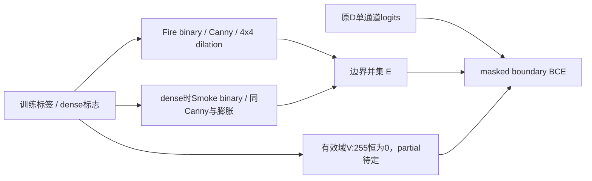

# B1 双类别边界监督设计提案

状态：阶段 0，待审批。工单正文额外列明的监督臂；不计作网络结构原创。预期主轴：Smoke精度及边界F1记录。

## 接入与结构

提案保持现有D单通道边界head，不改成两个head。dense样本目标为Fire边界与Smoke边界的**并集**；部分标签样本的有效域需审批明确。位置 `G:/py2/src/flame3_dataset.py:29,269` 和 `src/custom_losses.py:1051,1108`。

旧代码实际为Canny阈值0.1/0.2、`ones((4,4))`膨胀一次、>50二值化；“4px”应沿旧代码 **4x4核，不是半径4或9x9核**。原Fire算法/其余语义损失、语义边界损失权重都不改。D的变化会经末端边界门及semantic-boundary项影响训练，不能说只是多报一个辅助loss。

屏蔽必须在BCE逐像素reduction之前，并且class-balance正负计数也仅在V内；全空V返回与logits相连的零loss，不产生NaN。不能先reduction后乘mask。dense样本`V=(label!=255)`。

**部分标签阻塞**：现有partial非Fire像素可表示{Background,Smoke}，若将未知Smoke视为“无边界”训练，会引入未声明负标签。提案在partial样本仅监督已知Fire内部和已知Fire边界：`V_partial=(label!=255) & ((label==2) | (E_F>0))`，边界目标只用E_F；其余非Fire未知区域不作并集负样本。这额外改变旧D负样本有效域，必须明确批准，不能声称只屏蔽255就已经解决。另一口径需书面替代，当前不实现。

Ignore周围Canny可能产生不真实轮廓，本提案不擅自增添ignore膨胀排除圈；此局限须审批确认或在结果前补充统一规则。

## 预算

推理结构不变，7,623,939参数、7.470914 GMACs，增量0。Canny/掩码BCE是训练开销，未测。本阶段未读取任何标签、未生成任何边界图。

## 历史与边界F1

`G:/py2/src/custom_losses.py:151`已有FireBoundaryAuxLoss，采用内部边缘、BCE/Dice，与本臂复用D head的双类别Canny并集不同；旧ABL开关在冻结配置中关闭（`configs/flame3/pidnet_s_fusion_manual_smoke_v11_30e.yaml:74`）。B1不能顺带开启ABL或另加Dice。

Smoke边界F1应由**主语义预测的class1**与dense人工Smoke边界计算，不用类别混合D输出充当Smoke预测。待批建议：val47原分辨率，二者相同Canny取未膨胀细边，4x4膨胀仅作匹配容差，忽略255，聚合边界precision/recall再求F1；同时空/仅一侧空与ignore邻域规则须先冻结（建议双空记NA并列数量、单空记0、总体micro计数）。该指标只记录，不新增通过规则。

## 待审批与工程门

确认该额外臂计数、单head并集、partial有效域、4x4解释、F1及ignore邻域规则。partial语义loss本身不改，应以相同logits/targets断言一致，不能要求不同网络产生相同总loss。任何一项未定不得自行开训。
