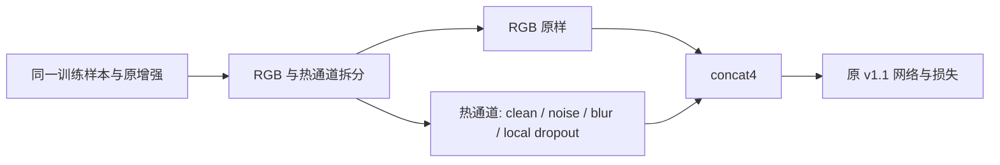

# R1 热退化增强设计提案

状态：阶段 0，待审批。预期主轴：热退化鲁棒；本臂不是网络结构创新证据，是R2的学习条件对照。

## 接入与结构

只在训练共同几何增强及[0,1]输入归一化之后、送入网络之前处理channel3。RGB三通道逐元素保持不变，不改标签、不保存退化图像。候选接入边界 `G:/py2/src/flame3_dataset.py:255`；基线网络不动。

**工单未给出的随机细节，以下只是审批提案**：每样本p=.5保留干净；其余p=.5均匀三选一，不叠加。噪声sigma~U[0,.05]，逐像素独立高斯后clamp[0,1]；Gaussian blur sigma~U[.5,1.5]、radius=ceil(3sigma)、反射padding、归一化可分离核；dropout为随机位置128x128置0，恰为512x640面积5%，不是“每像素5%散点”，也不是“5%概率触发”。若工单5%的含义不同，必须先修订此设计。

使用独立、确定性的增强随机流 `(seed,epoch,sample_key,visit)`；不消耗基线采样/几何增强随机流。R1/R3同种子同样本同次访问用相同退化，实现2x2配对。验证不沿用训练随机流。

## 预算

推理参数增量0、GMAC增量0，仍7,623,939参数、7.470914 GMACs。训练数据增强耗时不算网络GMAC，也未测；不能写训练零开销。

## 历史与评估差异

MRFF是架构门控，不是本训练退化对照；NTS不能自动视为R1同义。本臂不改热标定、不引入人工标签内容或模型误差指导采样。评估扰动必须复用冻结源文件 `C:/Users/钱鹏程QQ78293044/Documents/论文2/FLAME3_SUBMISSION_SOURCE_20260822/src/evaluate_test107_posthoc.py:117,136` 的stable_seed/perturb；只从val47调用适配接口，绝不运行该test107 CLI。当前仅阅读源代码，不导入执行。

## 待审批与工程门

批准概率、blur范围、5%面积解释、独立RNG及插入位置。热噪声sigma以网络[0,1]输入为单位，不解释为摄氏温度。评估的.02/.05/.10、两个zero条件和通过阈值一律不改。R1“有效”仅说明训练策略对照有效，不单独计网络贡献。
