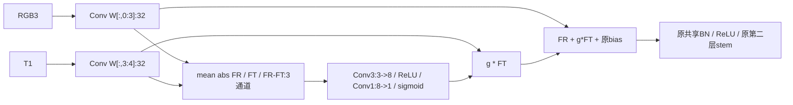

# R2 第一层通道拆分与热可靠性门设计提案

状态：阶段 0，待审批；门初始化存在实质性阻塞，当前不得进入实现。预期主轴：Smoke鲁棒。

## 接入与结构

只拆 `conv1[0]` 第一层4->32,k3,s2,p1，第二层32->32、全部共享BN/ReLU和后续网络保持。拆分结果32x256x320。在**第一次共享BN之前**相加；两支不各自拥有BN或ReLU。定位 `G:/py2/third_party/RoboFireFuseNet/models/pidnet.py:26`。

卷积切片两支均不带bias，原bias32只加一次。`g`为空间1通道，广播32。descriptor没有detach，使门与两路共同可学。门Conv3 padding1 bias=False；末层bias=True，共225参数。固定实数公式：`g=sigmoid(Conv1(ReLU(Conv3(descriptor))))`。

**初始化提案及阻塞**：严格按“饱和到1”的字面要求，末层W=0、b=20，门第一层常规初始化；但有限实数sigmoid不等于1，浮点舍入到1又可能使梯度为0，AMP更突出。不能把“初始数值近1”当成“门可训练且等价”已得到证明。拆成两个卷积还改变浮点累加顺序，末端logit `<1e-6` 未必自动成立。

供另行批准的替代是 `g=2*sigmoid(z), z初始0`，数学上g=1且有梯度，但范围变为(0,2)，不再只是抑制，**这违反原文饱和门的具体设定，当前未采纳、未实现**。也不得用硬开关/直通估计悄悄规避。

权重切片必须来自同seed、同冻结初始化协议的**基线初始化态**；不得用epoch30训练权重给R2热启动而让基线从随机起跑。工单“v1.1 stem权重”具体指向须确认。除替换张量外，从相同初始化态复制原网络；新增门RNG不能漂移其余权重。

## 预算

拆分原卷积权重数量不变，bias只保留一份。新增225参数；整网7,624,164。门卷积224*256*320=18,350,080 MAC；整网代理7.489264 GMACs，+0.246%。两次kernel调用、descriptor规约及32通道逐元素乘法不由代理反映。未经实现不能报延迟。

## 历史差异，不沿用错误对比

| 项 | MRFF | CMRC | R2提案 |
|---|---|---|---|
| 接入 | **本来就是stem**，独立两层RGB/T分支至1/4再融合 | 保留原stem，在layer2后1/8加修正 | 第一层线性卷积1/2，首个共享BN前 |
| 运算 | 非线性双stem，RGB/T softmax互补加权 | shared + .1*tanh(旁路修正) | RGB恒定系数1，只门控热贡献 |
| 初始化 | 两stem随机，末门zero使.5/.5，不等价原stem | **final correction零初始化，已基线等价** | 意图切片等价，但饱和门与浮点问题待解 |
| 旧/新判定轴 | 历史干净Fire指标 | 历史干净Fire多seed | 当前val47 Smoke与热噪声曲线 |

源码证据：`G:/py2/src/custom_models/pidnet_mrff.py:9,39,119,145`；`pidnet_cmrc.py:59,174,203,224`。因此“stem vs 中层”仅能对CMRC说，“精确等价 vs 随机”仅能对MRFF说；不能对两者一概而论。

历史报告证据：`G:/py2/docs/FLAME3_MRFF_NTS_PREREGISTRATION_2026-08-06.md:66`记AMP部署转换最大logit差0.140625，不是新臂结果；`PROJECT_STATUS_OVERVIEW_2026-08-16.md:66`记CMRC旧Fire多seed均值-0.013且种子分歧。该总览:70仅说MRFF+NTS组合未运行，**本次未找到MRFF独立多seed失败结果的可核验原始记录，不能填入传闻数字**。此前路线锁需由本v2审批明确解锁到列明R2/R3，不泛化重开融合搜索。

## 待审批与工程门

须先决定门公式与初始化语义；不批准就保持设计状态。未来工程门同时检查初始前向 `<1e-6` 与门梯度非零/热扰动可响应，不能只有前者。容差、dtype、输入集合要在结果前明确，不偷偷改宽。当前预算是原饱和sigmoid版，未做任何前向。
