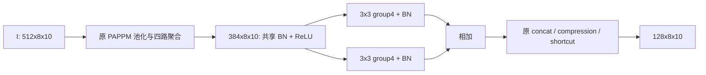

# S1 RPPM 设计提案

状态：阶段 0，待审批。预期主轴：干净 Smoke 精度；不预先宣称有效或创新。

## 接入与结构

唯一替换 `self.spp` 内的 `scale_process`。其余池化、插值、96 通道分支、480->128 压缩及 shortcut 不动。输入 `512x8x10`，输出 `128x8x10`，再沿原路径插值至 `64x80`。定位：`G:/py2/third_party/RoboFireFuseNet/models/pidnet.py:71`；`pidnet_utils.py:196,227,247`。

两支均 `384->384,k3,s1,p1,groups4,bias=False`；支路内不得加入阻止折叠的激活。保留共享前置 BN/ReLU。部署将各支 Conv+BN 折叠后，权重与偏置相加为一层 grouped3x3。**部署多 384 个 bias**，不能声称与当前无 bias 的 PAPPM 参数逐字相同。除这个必要偏置外拓扑相同。

初始化：沿基线初始化协议；新支路独立初始化，不要求对基线初始输出等价。未改动张量须从同种子基线初始化态复制；不借用已训练权重。

## 预算

训练替换部分 665,856 参数，原部分 332,544；训练参数增量 +333,312。部署替换部分 332,928，总计 7,624,323 参数。部署卷积 MAC 增量 0，整网静态代理 7.470914 GMACs；训练前向卷积增量 0.026542080 G，不含反向。

逐算子见 `../stage0/OPERATOR_LEDGER.csv`，机器可读结果见本目录 `COST.json`。BN、激活等增量未算入 MAC 代理，P95/显存未测。

## 历史与来源

RDRNet arXiv:2406.12496，§III-C / Fig.6；本地 `C:/Tmp/flame3_papers_20260917/rdrnet_2406.12496.txt:658`。这是局部适配 RPPM，未搬迁整个 RDRNet。LSCM 在上采样后的 context 上额外做膨胀卷积与 smoke gate（`G:/py2/src/custom_models/pidnet_lscm.py:21,75,153`），S1 不增加该推理路径。DySample/FreqFusion 改采样过程，S1 保持原插值。

## 待审批与工程门

批准两支、group4、保留前置 BN/ReLU及部署 bias 的具体适配。折叠误差 `<1e-4` 应在同权重、同输入、BN eval 状态比较未折叠/折叠形态；训练模式 BN 批统计不能与部署直接比较。FP32 与 AMP 均记录，不能因超差放宽阈值。本阶段未做该测试。
