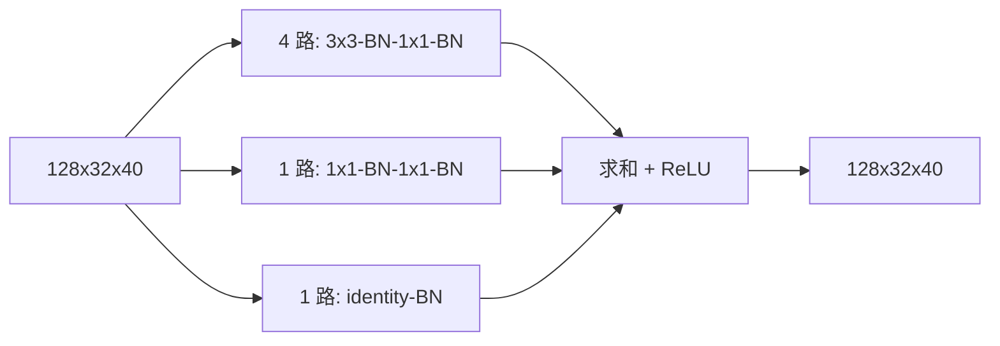

# S2 GCBlock 设计提案

状态：阶段 0，待审批，列入第二批。预期主轴：Smoke 精度；同时记录效率，不能靠工程 R3 规则取得创新资格。

## 接入与结构

仅替换 I 分支 `layer3[1]`，不是 P 的 `layer3_`。输入/输出 `128x32x40`，stride1。保留下采样首块与末块 `no_relu=True` 接口。定位：`G:/py2/third_party/RoboFireFuseNet/models/pidnet.py:38,108`，`pidnet_utils.py:12`。

所有 Conv 等宽128、bias=False；3x3 padding1。各支路内部无激活，末尾一个 ReLU。固定 `N=4`，不在看到结果后挑分支数。部署为一个 `128->128` 的带 bias 3x3 + ReLU，不再保留外置残差，identity 已并入卷积。

顺序折叠只用 `3x3->1x1`，不反过来用带偏置 `1x1->padded3x3` 以免边界偏置不等价。不能将原两层含 ReLU 的 BasicBlock 精确变换为 GCBlock，故新块按同协议随机初始化，不承诺初始等价。

## 预算

原块 295,424 参数；训练 GCBlock 690,944，增量 +395,520；部署 147,584，整网 7,476,099，净减 147,840。部署净减 0.188743680 GMAC，整网代理 7.282170 GMACs，约 -2.526%。训练前向增加 0.503316480 G 卷积 MAC。P95/显存待工程门，训练显存不由部署参数推断。

## 历史与来源

GCNet arXiv:2503.03325 §3.2、Fig.3，`C:/Tmp/flame3_papers_20260917/gcnet_2503.03325.txt:420,713`。保留原文小网络 N=4 配置，但只移植一个块。LSCM 是不可折叠的条件上下文残差；MRFF/CMRC 是模态处理，不是训练多路到部署单卷积。S1 作用在 SPP grouped conv，此臂作用在 I 特征提取块，不能组合为一个单变量臂。

## 待审批与工程门

批准位置/N=4。与 S1 一样，同 BN eval 状态前向折叠误差 `<1e-4`，不得拿 train-mode BN 比较部署；实际 AMP 误差未测。旧 MRFF 存在 AMP 转换误差记录，故不能凭代数折叠判为已过门。第二批不自动实现或运行。
