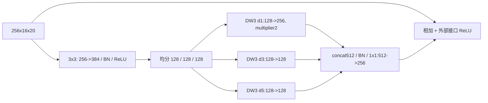

# S3 DWR 设计提案

状态：阶段 0，待审批。预期主轴：Smoke 精度。

## 接入与结构

固定替换 `layer4[1]`，输入/输出 `256x16x20`。选择深层而非 layer3，以容纳 d=5 的 11x11 支路；不在预检结果后换位置。定位：`G:/py2/third_party/RoboFireFuseNet/models/pidnet.py:39,108`。

按 DWR Fig.4 的 RR 扩张1.5倍、SR输出2:1:1。三路groups均128，padding分别1/3/5；卷积bias=False。concat后的BN512等价于三段独立BN256/128/128，账本按后者列数。SR不加ReLU，融合1x1后不加BN；只补一个残差输出 ReLU，以保持被替换 PIDNet 非末块的接口。

## 预算

原块1,180,672参数，新块1,022,208，净减158,464。新块卷积MAC0.326533120 G，旧0.377487360 G；整网7,465,475参数、7.419960 GMACs代理。详细公式见算子账本。延迟未测。

## 历史与来源

DWRSeg arXiv:2212.01173 Fig.4 / §3.2，`C:/Tmp/flame3_papers_20260917/dwrseg_2212.01173.txt:301,356,713`。与 LSCM（`G:/py2/src/custom_models/pidnet_lscm.py:21,26,75`）均有多膨胀率 DW，但 LSCM 所有尺度读同一个降维特征、输出在SPP后上采样1/8处附加且带smoke gate；本臂先生成区域特征、不同通道只分配一个膨胀率、替换I块、不使用类条件门。共享“多尺度上下文”思想，不能只凭换位置宣称原创。

## 待审批与工程门

批准 layer4[1] 与固定三路配置。必须检查 depthwise multiplier2 的实现，不可误写成普通128->256密集卷积。旧LSCM的长训结果不能当作此臂已被否定，也不能因短训领先直接进入论文主贡献。
