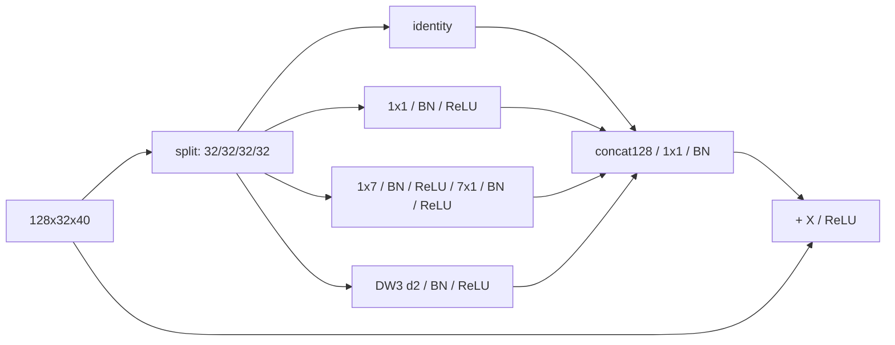

# S4 矩形卷积分组块设计提案

状态：阶段 0，待审批。预期主轴：Smoke 精度。

## 接入与结构

只替换 `layer3[1]`，`128x32x40 -> 128x32x40`；定位 `G:/py2/third_party/RoboFireFuseNet/models/pidnet.py:38,108`。

矩形支路两层顺序相接，组内为普通32->32卷积，不是depthwise；padding=(0,3)/(3,0)。d2分支depthwise32，padding2。所有Conv bias=False。不引入 SmokeNet 的maxpool、二分类头和其余网络。最终1x1融合是适配PIDNet残差接口，不将整个块冒称原文逐项复现。

## 预算

替换块32,544参数，原295,424；整网7,361,059，净减262,880。新卷积MAC0.041000960 G，净减0.336486400 G；整网代理7.134428 GMACs，-4.504%。容量下降明显，精度变化不能仅归因于方向先验；未来容量对照须另行批准，不偷偷追加。

## 历史与来源

SmokeNet arXiv:2502.12258 §2/多尺度部分，`C:/Tmp/flame3_papers_20260917/smokenet_2502.12258.txt:288,324`。原文包含1x3/1x5等，**1x7和固定d2是本工单的适配，不是原文原参数**。

LSCM源码 `G:/py2/src/custom_models/pidnet_lscm.py:26,75,153`：同一输入的三路3x3 DW(d1/2/3)，SPP后附加、类条件门；S4是分通道identity/pointwise/方向/局部空洞、I块替换、无smoke gate。两者多尺度思想重合，中等机制重合度，不靠重命名解释。与S3相比，S3是RR后每组单一膨胀率，S4明确保留不处理/点处理/方向处理通道。

## 待审批与工程门

批准工单“1x7 + 7x1”解释为串联、d2采用depthwise、以及layer3[1]。若用户意图是并联求和，需在实现前修订预算；不得混用两个版本择优。未读取任何标签或误差图来选择方向。
