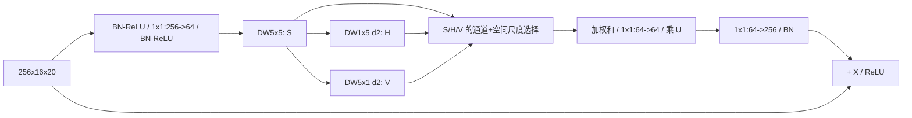

# S5 稀疏条带大核与尺度选择设计提案

状态：阶段 0，待审批，第二批。预期主轴：Smoke 精度。

## 接入与结构

只替换 `layer4[1]`，`256x16x20`。定位 `G:/py2/third_party/RoboFireFuseNet/models/pidnet.py:39`。用64通道瓶颈适配，不搬移整个EVA/CFFN，也不改变SPP。

`S=DW5(U)`，`H=DW1x5_d2(S)`，`V=DW5x1_d2(S)`，保持16x20。有效感受野分别5x5、5x13、13x5，避免照搬原文35像素核覆盖高度16的特征。

固定选择器：`Z=S+H+V`；`c=Conv16->192(ReLU(Conv64->16(GAP(Z))))` reshape为3x64x1x1；`s=Conv7x7_2->3(cat(channel_mean(Z),channel_max(Z)))`。`w=softmax_scale(c+s)`，`F=sum(w_j*branch_j)`。输出 `ReLU(X+BN(Conv64->256(U*Conv64->64(F))))`。所有特征卷积bias=False，选择器两层1x1和7x7带bias。尺度softmax不改训练损失。

这是 **SDLSKA/CKS思想的局部缩小适配**，选择器写法并非声称原作者代码逐项一致；不以此命名新的原创模块。

## 预算

新块44,857参数，原1,180,672，净减1,135,815；整网6,488,124。新卷积MAC0.012611456 G，净减0.364875904 G，整网代理7.106038 GMACs，-4.884%。不含门控逐元素乘法、softmax和池化；P95不能由MAC下降推断。容量大幅变化是解释限制。

## 历史与来源

BEVANet arXiv:2508.07300 Fig.2 / §2.2，`C:/Tmp/flame3_papers_20260917/bevanet_2508.07300.txt:184,252`。原文5x5后1x11/11x1,d3，本提案缩为5、d2并固定瓶颈。

与LSCM共享多尺度，但历史LSCM为共享输入三路DW3、smoke门、SPP后附加，本臂为小核后条带、空间+通道的尺度竞争、深层替换。与FreqFusion（`G:/py2/src/custom_models/pidnet_freqfusion.py:220,269,339`）不同，不生成重采样位置、不做ALPF/AHPF、不处理跨分辨率对齐。不能将FreqFusion旧工程超延迟等同于此臂必然超时。

## 待审批与工程门

批准上述局部适配及64瓶颈；它不是完整BEVANet的效果复现。测试feature shape、软权重数值与梯度需审批后进行。与S3同位置不同机制的容量不等，后续归因需明确而非把差异全部解释为大核效应。
