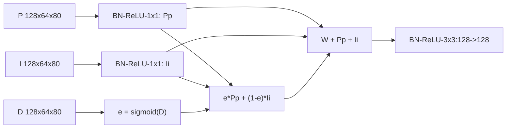

# S6 BGAF式边界引导末端融合设计提案

状态：阶段 0，待审批。预期主轴：Smoke 精度与热退化鲁棒性，后者只是待验证假设。

## 接入与结构

仅替换 `self.dfm`，P/I/D均为 `128x64x80`，输出同形状。D路径和D监督不动，不叠加B1。定位 `G:/py2/third_party/RoboFireFuseNet/models/pidnet.py:72,197`。

明确定义 `Pp=Conv1(ReLU(BN(P)))`，`Ii`同理；`Y=Conv3(ReLU(BN(e*Pp+(1-e)*Ii+Pp+Ii)))`。卷积bias=False，不新增可学习门、不改D通道数。残差是保留投影后的两路信息，不声称原始输入无损直通。

**与 Light_Bag 的实质差异**：旧公式为 `ConvBN_p(P+(1-e)*I)+ConvBN_i(I+e*P)`，原本已有边界权重。新式在融合前分别非线性投影，门控发生在投影后；在权重之外显式保留两路投影和；融合后加3x3空间聚合。不能宣传“首次引入边界引导”，也不能将没有非线性/空间卷积的代数改写当作新结构。

## 预算

旧Light_Bag 33,280参数，新180,992，增量147,712；整网7,771,651。卷积MAC增加0.754974720 G，整网8.225889 GMACs代理，+10.106%，目前离+15%尚有约0.365 G余量。额外边界乘加不计入代理；真实P95未知。

## 历史与来源

原式证据 `G:/py2/third_party/RoboFireFuseNet/models/pidnet_utils.py:314,328`；相邻 `DDFMv2:337` 已有pre-BN/ReLU，故仅把BN提前也不足以解释差异。BEVANet arXiv:2508.07300 Fig.5 / §2.4，`C:/Tmp/flame3_papers_20260917/bevanet_2508.07300.txt:296`。本提案为明示算子的BGAF式适配，不声称完全复刻作者实现。

与LSCM的类条件context门、MRFF模态门及CMRC中层残差都不同；本臂仍只用已有D特征作最终融合条件，不提前实现H-A的“D控制I上下文尺度选择”。

## 待审批与工程门

批准固定公式及额外3x3。新增计算量不能被解释为纯“边界机制”收益；需要后续消融才能分离。超预算按v2仍可后续训练评估但不得进入设计层，不能由本静态表提前判定已过效率门。
