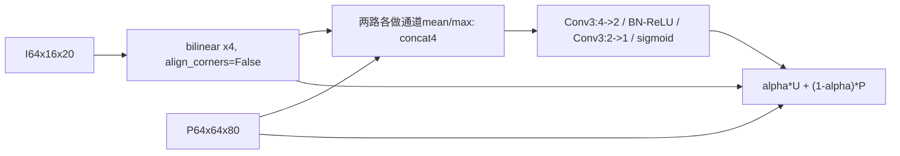

# S7 UAFM-Spatial 设计提案

状态：阶段 0，待审批，第二批。预期主轴：Smoke 精度。

## 接入与结构

只替换 `pag4`，保留 `compression4`、pag3和所有双向支路。P `64x64x80`，压缩I `64x16x20`，输出 `64x64x80`。定位 `G:/py2/third_party/RoboFireFuseNet/models/pidnet.py:47,53,182`；原PagFM见 `pidnet_utils.py:268`。

固定空间注意力，不再叠加通道注意力；Conv3 padding1，第一层bias=False，末层bias=True。因为两路已有64通道，不额外移植FLD的通道适配或输出3x3。仅替换权重生成器，不附带SPPM或骨干变更。

## 预算

原pag4 4,224参数，新95；整网7,619,810，净减4,129。Conv MAC新0.000460800 G、旧0.011141120 G；整网代理7.460234 GMACs，-0.143%。mean/max是规约算子，其代价不在卷积代理里，不能承诺更快。

## 历史与来源

PP-LiteSeg arXiv:2204.02681 §3.2 / Fig.4，`C:/Tmp/flame3_papers_20260917/ppliteseg_2204.02681.txt:237,268`；提案固定4->2->1卷积细节，属于单模块适配。

原PagFM在32维投影上做逐像素点积求相似度，本臂改为空间统计attention。DySample（`G:/py2/src/custom_models/pidnet_dysample.py:46,85,133`）保留PagFM权重但替换上采样坐标，本臂保留bilinear；FreqFusion（`pidnet_freqfusion.py:269,339`）在pag3做频率滤波与重采样，本臂不做这些。相同接入点不代表重跑相同机制。

## 待审批与工程门

批准pag4、空间版与无附加输出卷积。mean/max的AMP数值、权重饱和和门控梯度需阶段1验证，当前不运行。对热噪声的潜在作用不得未经结果提升为预期已实现。
