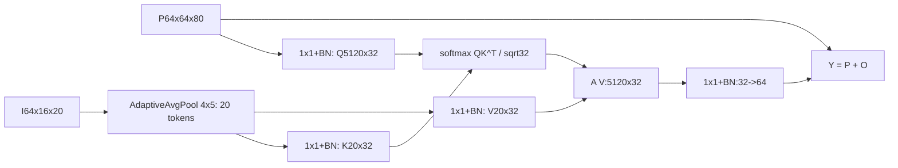

# S8 低token跨分辨率注意力设计提案

状态：阶段 0，待审批，第二批。预期主轴：Smoke 精度与鲁棒。

## 接入与结构

仅替换pag4，保留compression4。输入P `64x64x80`，I `64x16x20`。输出 `64x64x80`；代码接入与S7相同。

固定单头、d32、token4x5=20，softmax只沿20个token。所有Conv bias=False；不引入多头/FFN/位置编码/额外GFA，也不叠加原PagFM。分辨率变化使用固定20token而非随图像增长，当前预注册仍固定512x640。

## 预算

参数8,512替换4,224，净增4,288；整网7,628,227。QK与AV分别3,276,800 MAC，总6,553,600；加投影后新0.027607040 G，净增0.016465920 G，整网代理7.487380 GMACs，+0.220%。注意力矩阵5120x20=102,400元素，单份FP16约0.195 MiB，不是训练峰值显存估计。

## 历史与来源

RTFormer arXiv:2210.07124 §3.1 equation4，`C:/Tmp/flame3_papers_20260917/rtformer_2210.07124.txt:238`：由低分辨率生成K/V，高分辨率查询。这里仅借鉴cross-resolution部分，不称完整RTFormer复现。

DySample/FreqFusion调整坐标或局部频率；S8在固定token池中全局内容检索，无可学习采样坐标。LSCM是局部卷积上下文，不是P查询低分辨率I的全局匹配。也不是完整PBSeg原型解码器：无类别原型/原型损失/新增decoder。与S7都替pag4但权重空间不同：S7每像素混两路，S8每像素查询20个I位置。

## 待审批与工程门

批准20tokens、32维、单头及残差公式。真实矩阵乘/softmax性能必须按4090协议测，GMAC不预测P95；注意力对局部边界的损伤须靠护栏检验，不能看结果后追加局部分支。
